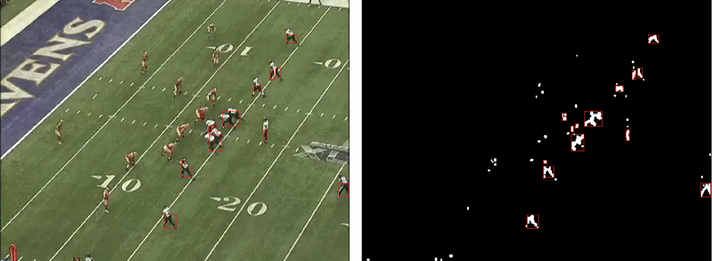

# 3D Football Play Reconstruction Project
## Introduction
### Motivation
American football is an incredibly intricate and nuanced sport where even minute details can impact the outcome of a play, game, or season overall. However, to the average fan, these details are largely unnoticed due to their viewing of the sport being limited to one wide-view camera angle (Figure 1). In search of a more immersive experience for fans, television broadcasts have begun to show the sport from different angles to give people a chance to see the game from the perspective of different players on the field. From cameras attached to gimbals suspended across football stadiums to cameras inside endzone pylons to even cameras attached to referees, fans have increasingly more opportunities to see the game from a different lens (Figure 2). We propose a method for the next step in football-viewing immersion: an interactive 3-dimensional virtual recreation of football plays. 

(Figure 1: Traditional view for football broadcasts)

(Figure 2: Examples of different cameras used to provide alternate angles of football games)

### Inspiration
This project is inspired by numerous previous works. The idea for a more interactive viewing experience comes from existing first-person and virtual reality football simulation games (Figure 3). Organized football is by nature an exclusive sport due to the equipment, staff, and number of different kinds of athletes needed to play it. These games allow the user to simulate the sport as an athlete on the field. With the rapid growth of virtual and augmented reality technology, the ability to extend this concept to viewing real-life games virtually would be an exciting new way to improve the fan experience of football. The feasibility for such a task comes from the work of Zhu et al. at the University of Washington, who reconstructed in-game still images of NBA players in 3D by wrapping the output of a pose estimation neural network with player meshes from the NBA2K video games. This allowed them to recreate the still image virtually and see it from any angle (Figure 4) [1]. We hoped to follow a similar pipeline for each player on the football field for every frame of a particular play for our 3D virtual recreation.

(Figure 3: Example of first-person football simulation games)

(Figure 4: Pipeline for the 3D reconstruction of NBA players)

### Implication
This project has implications beyond just fan experience. The ability to view football plays in this fashion would also be beneficial to coaches and players studying football film by giving them the ability to interact in-depth with the play. For example, fixing the virtual camera to a simulated player's helmet can allow the viewer to see the field from that player's perspective. This can assist coaches in teaching players what to see on the field by giving them a better simulation of a play than the traditional high-angle camera view.

## Related Works
### Context
Zhu, L., Rematas, K., Curless, B., Seitz, S. M., & Kemelmacher-Shlizerman, I. (2020). Reconstructing nba players. In Computer Vision–ECCV 2020: 16th European Conference, Glasgow, UK, August 23–28, 2020, Proceedings, Part V 16 (pp. 177-194). Springer International Publishing. [https://arxiv.org/pdf/2007.13303.pdf](url) 

This paper describes a process for 3D pose reconstruction of a basketball player from a single 2D image. This paper improved over the state of the art at the time by focusing on all aspects of a player’s physique and clothing, instead of just estimated interest points in their bodies. This improvement allows for the simulation of any pose, viewpoint, combination of players, and background within the given scene.

Lee, T. E. (2015). Automating NFL Film Study: Using Computer Vision to Analyze All-‐22 NFL Film. [https://cvgl.stanford.edu/teaching/cs231a_winter1415/prev/projects/LeeTimothy.pdf](url) 

This paper discusses a series of algorithms developed to extract information from football plays. Algorithms described in the paper complete the tasks of field reconstruction through Hough transforms and player recognition through blob tracking techniques focused on unique color patterns of the different teams present in the play.

Nie, X., Chen, S., & Hamid, R. (2021). A robust and efficient framework for sports-field registration. In Proceedings of the IEEE/CVF Winter Conference on Applications of Computer Vision (pp. 1936-1944). [https://openaccess.thecvf.com/content/WACV2021/papers/Nie_A_Robust_and_Efficient_Framework_for_Sports-Field_Registration_WACV_2021_paper.pdf](url) 

This paper discusses a framework for registering sports fields in challenging scenarios. Two particular scenarios covered in the paper are when the field does not have distinguishable features and when there is no prior knowledge available about the camera. To account for these challenges, the authors of this paper created a grid of key points uniformly distributed on the field instead of local features, to represent all parts of the field, including those that have a uniform pattern.

Riedel, W., Guillory, D., & Mwangi, T. (2013). EE368 Project: Football Video Registration and Player Detection. [https://stacks.stanford.edu/file/druid:yt916dh6570/Guillory_Mwangi_Riedel_Player_Identification_and_Tracking.pdf](url) 

This paper describes methods for automatic football video registration and player detection for use in football play analysis. The paper includes a description of methods for line mapping and unique feature identification for video registration and color filtering for player detection.

Redmon, J., Divvala, S., Girshick, R., & Farhadi, A. (2016). You only look once: Unified, real-time object detection. In Proceedings of the IEEE conference on computer vision and pattern recognition (pp. 779-788).
[https://arxiv.org/pdf/1506.02640.pdf](url)

YOLOv8 is the 8th version of a deep learning model applied for object detection, created by Joseph Redmon and Ali Farhadi at the University of Washington. YOLO uses a single neural network to predict bounding boxes and class probabilities for detected objects in an image. YOLO is an improvement over previous object detection models, as it is extremely fast and learns very general representations of objects, allowing it to be applied effectively in many different scenarios.

### Project in Context
Many of the related works above provide methods for recognizing conditions of a sports play, including locations of important points on the playing surface and positions of players on this surface. Additionally, many of the existing works deal with creating 3D reconstructions from 2D images. However, all of these works focus solely on one of these aspects, and they all focus on image reconstruction instead of video reconstruction. Our project combines 3D field reconstruction with player position recognition and 3D reconstruction throughout multiple frames to allow for the 3D reconstruction of full football plays from videos.
## Methods and Approach
### 3D Virtual Environment
Existing methods of football play simulation found as described in our related works only play a video in 2D or simulate single frames in 3D. However, to accomplish our goal of simulating an entire play in 3D, we needed an environment in which all objects in the play could be represented in 3D. This is necessary because if we can represent every player and their position on the field from a football play in 3D, then we can view this play from any angle. Unity has functionality that allows us to view a 3D scene from any angle we choose, so Unity is a great platform in which to accomplish this task.

To create the 3D virtual environment representation of the football field and players, we utilized the Unity game engine. Within Unity, we can create game objects for the field and players with 3D coordinates and run a simulation to view these 3D objects from any angle. In this project, we successfully created the 3D football field representation within a Unity project. To create the field, we mapped a 2D field image to a 3D object in the Unity project. We utilized official NCAA football field diagrams and guidelines to set the coordinates of different interest points on the field and calibrate the coordinate system of the field object. 

3D players are represented as humanoid Unity game objects in the determined 3D position of each player (Figure 5). For future iterations of this project, pose recreation meshes can be used in place of humanoids to make the player representation even more realistic. These methods were avoided in this project to keep computation requirements to a minimum.

(Figure 5: Unity game objects in positions of each player)
### Homography and Field Interest Point Detection
Since the camera for football games is traditionally at an angle and capable of panning and zooming, player positions within the frame of the camera cannot be simply mapped one-to-one to our virtual field. Instead, we applied homography to estimate the correct corresponding location of a player to our virtual field by finding the homography matrix using fixed points on both the real-world field and our virtual one for each frame of the play (Figure 6). Luckily, football fields are all required to have the same dimensions and markings on them, so our interest points were already known: the intersections of the hash marks and yard lines on the field. We chose these as interest points because of their size and consistency across different fields. Other required markings on football fields, such as logos and numbers, are subject to different sizes and locations on the field [2]. The homography matrix was calculated by passing the source and destination interest points to the ProjectiveTransform class from the Scikit-Image Python library [3]. The destination interest points were found manually for the virtual football field environment. The process for finding the source interest points from the video of a real-world football play is detailed below. 

(Figure 6: Projection of real-world field onto virtual field using homography)

We first filtered each frame of the play video using the Gaussian bilateral edge-preserving denoising filter from the Scikit-Image Python library [4]. It removes noise based on a Gaussian function of pixels' geometric and colorimetric Euclidean distance [5]. We also applied sigmoid exposure correction from the same library to ensure consistent contrast for each frame of the video [6][7]. These filters and corrections allow us to negate any frame-to-frame change in brightness or noise throughout the video. Each frame was then converted to grayscale (Figure 7). 

(Figure 7:  Original frame (left) and filtered grayscale frame (right))

To identify the yard lines of the field, we applied Canny edge detection to retrieve the contours of each frame without any fine details [8] (Figure 8). The Canny edge detector first smooths the image according to a parameter, sigma, then identifies edges based on the image’s gradient magnitudes and directions. Edges are identified if a pixel’s gradient magnitude passes a certain high threshold, and are continued as long as gradients of the same direction pass a lower threshold [9]. We then performed the Hough Lines Transform on the binary edge-detected image, which leverages the fact that lines intersecting at a point in the x-y coordinate plane form a sinusoidal curve when that point is converted to its polar form [10]. When these sinusoidal curves are drawn for multiple points along a line, the curves will intersect at a singular location. The Hough Lines Transform creates a sinusoidal curve in the polar coordinate system for each detected edge point and identifies straight lines based on the number of curves at each intersection (Figure 9)  [11]. These lines were then filtered based on their location, distance from each other, and slope to return the yard lines of the field (Figure 10). 

(Figure 8: Canny edge-detected frame)

(Figure 9: Sinusoidal curves from Hough Lines Transform)

(Figure 10: Yard lines of field using output from Hough Lines Transform)

Blob detection using the Difference of Gaussian (DoG) method was used to identify the hash marks on the field for the first frame of the play video [12]. Blob detection uses Gaussian kernels of varying standard deviations to identify features of different sizes in an image [13]. In our case, we used a Gaussian kernel with a standard deviation of 4 to detect the hash marks on the field. Before running blob detection, we performed Canny edge detection on the frame to remove as much detail as possible to reduce the number of objects detected by the blob detection algorithm [8]. White rectangles were drawn on a black image in the locations where blobs were detected, then the Hough Lines Transform was run on the image (Figure 11) [10]. These lines were then filtered based on their location, distance from each other, and slope to return 2 lines passing through the hash marks of the field (Figure 12).

(Figure 11: Rectangles drawn where blobs detected)

(Figure 12: Hash mark lines of field using output from blob detection)

Once the yard lines and the hash mark lines were found for the first frame, we passed the intersections of these lines into the MultiTracker object tracker from OpenCV’s Legacy Tracking API (Figure 13) [14]. This allowed us to track our interest points across frames without having to run the computationally expensive blob detection algorithm on every frame of the play video. We still performed the Hough Lines Transform to identify yard lines on every frame to help recover interest points that may have been lost by the object tracker [10]. Lost interest points that had an undetected yard line passing through them were recovered by adding points where gaps existed. Gaps were determined based on the interest points’ distances from each other. 

(Figure 13: Intersections of yard lines and hash mark lines that are passed to object tracker)

Our approach for the field interest point detection was inspired by prior work and shares many of the same methodologies, including the interest points used for homography. Though Riedel et al. and Timothy Lee both also used the Hough Lines Transform to detect the yard lines and hash mark lines on the field, they ran this operation on every frame of the play instead of just the first frame as we did. This resulted in their processes being less reliable as they depended on successful outputs of Hough Lines Transform to generate a new set of interest points every frame. Relying on near-perfect Hough Lines Transform output may be feasible for yard lines which are large and defined, but not for hash marks which are smaller markings that may be obscured by players or motion blur from the camera. We found tracking these points after the first frame and only generating ones that are lost by the tracker to be more robust. The Hough Lines Transform and blob detection operations are computationally expensive as well, so running them on every frame of a video has dramatically longer runtimes compared to tracking the field interest points. Additionally, these pipelines, especially Timothy Lee’s which also used blob detection, required large amounts of manual filtering to highlight specific features of the field. We kept filtering to a minimum and only used filters that normalized our inputs. With these considerations, their work suggests that their interest point detection process may only work if each frame of the video satisfies certain conditions. The approach by Riedel et al. only worked 86% of the time on their best-case video, leaving gaps in the play [18][19].

### Pose Estimation

To estimate the poses of the players on the field for each video frame, we attempted to utilize the widely used and well-maintained OpenPose library, which is a real-time multi-person system for detecting human body, hand, facial, and foot keypoints on single images or video streams.
 
The OpenPose architecture consists of two main branches - the body branch and the hand branch. The body branch predicts a confidence map for each body part and a vector field pointing toward the locations of the body parts in the image. The hand branch predicts a similar set of confidence maps and vector fields for hand keypoints.
 
For our football pose estimation task, we attempted to focus on the body branch which follows a multi-stage pipeline:
 
Feature Extraction: A truncated residual network (ResNet) model pre-trained on ImageNet is used to extract low-level features from the input image.

Initial Prediction: These low-level image features are passed through multiple sequential convolutional layers to predict an initial set of confidence maps and Part Affinity Fields (PAFs). The confidence maps encode the confidence of a particular body part existing at each pixel location. The PAFs encode a 2D vector field pointing from one body part towards another, allowing the model to associate different body parts together.
Refinement: The initial predictions from the previous stage are iteratively refined over multiple stages using sequential convolutional layers to produce more accurate confidence maps and PAFs.

Parsing: The refined prediction maps are parsed by first generating bipartite graphs for each limb segment with vertices being the body part confidence maps and edges being the PAFs. These graphs are discretized into candidate keypoint locations using non-maximum suppression. The models then infer the most likely pose configurations by traversing along the PAFs from the body part candidates using a greedy bipartite matching algorithm.
To apply OpenPose to our football videos, we first run a person/player detection model on each frame to localize individual player bounding boxes. We then run the OpenPose body keypoint detection model on each bounding box region to predict the 2D body keypoint locations for that player instance, which we correspond with a detected location in that frame from the earlier homography step.
 
The 2D keypoint predictions are in the coordinate space of the original input frame. To map these to our 3D virtual environment coordinates, we attempted to combine the OpenPose outputs with the player localization results from our object detection model. Specifically, based on each projected player location calculated on our two-dimensional representation of player positions on the map, we attempted to map each keypoint location to the tracked and localized player in that location, which is then used to set that player's pose for that instance in the frame.
 
As it was highly likely and anticipated based on our experiments that we would experience some dropout in player and pose detection we attempted to use Butterworth filtering to fill in the interpolated gaps. However, upon experimentation, we realized that due to the low resolution of the video and reliance on pre-trained architectures and weights, we experienced a high level of dropout in pose estimation.

### Player Tracking
As an alternative to pose estimation, we trained a YOLOv8 object detection model on a dataset of labeled football players [15][16]. We ran the model on each frame of the play clip which returned the locations of each player for every frame. Since players may not be detected in every frame due to motion blur or occlusion, we developed a novel solution for recovering lost players while also assigning tracking IDs to each player. These IDs allowed us to track the movement of each individual player which would be used for their animation in the 3D reconstruction of the play. Using the assumption that the first frame’s detections captured all the players on the field, we assigned unique IDs to each of the first frame’s detections. On the following frames, the player IDs of the players for the preceding frame were assigned to the closest player detections on the subsequent frame, within a certain threshold. If the closest player on the succeeding frame was further than the threshold, the prior frame’s player was added to a “lost players” list. After iterating over all of the previous frame’s players, if any detections on the successive frame had not yet been assigned a player ID, they would get assigned the player ID of the closest player from the “lost players” list. For the frames where players were lost, the lost player locations were estimated based on the player’s location before being lost and after being recovered. 

Object tracking is an area of ongoing research and proposed solutions. In the common use of tracking, objects are assigned unique identifiers that ideally stay consistent throughout a video. However, these vanilla tracking algorithms are built assuming an unconstrained world, so fewer assumptions can be made about the objects in a video thus these identifiers are prone to changing often, so the same object can be identified as multiple different ones [20]. Our solution to object tracking benefits from the constraints of the sport of football, where there are a designated number of players and they must start from designated locations on the field at the start of each play. This not only allows us to make assumptions about who a detected player is on any given frame but also makes it easier for our model to detect each player at the beginning of a play. 

Prior research from Riedel et al. and Timothy Lee detected players using jersey colors to distinguish them from the field. However, this approach was too unreliable and unspecific for our needs, as any object that was of a similar color was detected as a player and players near each other were hard to distinguish (Figure 14) [18][19]. We found training a neural network for the player detection task to not only be more robust but also faster than their color filtering methods. 

(Figure 14: Detecting players using color filtering)
## Experiments
### 3D Virtual Environment
In our Unity 3D virtual environment, we first built functionality to represent a standard NCAA football field. The Unity game engine environment allows us to position cameras and view this field from any angle, as shown below (Figure 15, Figure 16).

(Figure 15: Top-down view of the Unity 3D field object)

(Figure 16: Angled view of the Unity 3D field object)

Additionally, this 3D field representation creates a coordinate system that player representations were placed into to join the 3D field and player representations together. Given the 3D positions of each player at every frame in the original video, we placed a humanoid object at each player’s 3D position for every frame (Figure 17).

(Figure 17: Humanoid object at each player’s position during play)

### Homography and Field Interest Point Detection
To test our approach for homography and interest point detection, we used the football player detection model described above. We tested the model and our virtual field projection pipeline on a play from a University of Florida versus Lousiana State University football game from 2019 (Figure 18) [17]. On each frame, the coordinates of every player detection from the model were multiplied by that frame’s homography matrix to retrieve the corresponding coordinates for a 2D football field diagram. After the locations of each player on the 2D diagram were determined for every frame, lines were drawn for each player through each of these coordinates on the diagram to return a position-accurate static representation of the play (Figure 19). 

(Figure 18: Play from 2019 UF vs. LSU football game with output from player detection model)

(Figure 19: Static representation of play by mapping player positions to virtual field using interest point and homography pipeline) 

### Pose Estimation 

The frame demonstrates players and detected sideline officials with their detected keypoints, which are then extracted and exported to a CSV file corresponding to the frame in play (Figure 20).

(Figure 20: Pose estimated points using YOLOv8 keypoint detection architecture)

Surprisingly, this was the only frame with detected keypoints for each of the players using the standard YOLOv8 keypoint detection architecture for pose estimation. Therefore, another approach was needed. Using OpenPose Net, we achieved much better, yet still highly variant results with unreasonably inaccurate player tracking and pose detection across multiple keyframes (Figure 21).

 

(Figure 21: Pose estimated points using OpenPose Net)

Whereas there exist some inaccuracies in the pose estimation that can be accounted for in filtering and correction operations, the reality is for a majority of players the pose details are lost across multiple frames, making it impossible to accurately interpolate pose locations. For player 20, there seemed to be some pose drift between two frames even though the player hadn't moved (Figure 22).

 

(Figure 22: Pose drift between subsequent frames)

Furthermore, recognize that a lot of the linemen's positions are lost. Therefore although we have rough pose estimates, they are not sufficient for a faithful recreation of the play in 3D and therefore they are omitted.
### Player Tracking

To train our football player detection model, we used a dataset found on Roboflow Universe, a database of open-source computer vision datasets [21]. The dataset contains 1454 images of football plays with the following labels: defense, quarterback, skill, referee, and offensive line. These labels provided extra information about each person on the field to allow us to give them different appearances on the 3D or 2D representation depending on their label. The images were preprocessed to be of size 1280x1280 for consistency. Data augmentation such as blurring, noise addition, and changing the hue, saturation, brightness, and exposure of the images was applied to increase the size of the dataset to 2856 total images (Figure 23). 

(Figure 23: Sample image from dataset)

The complete dataset was uploaded to Ultralytics HUB and trained for 300 epochs using their Cloud Training tool, allowing for offline training with NVIDIA T4 GPUs [22]. 90% of the dataset was used for training, 8% for validation, and 2% for testing. A robust model, given a frame of a football play, would successfully detect all players and assign them the correct labels depending on their position. This can be determined both visually and through the model’s mAP score, which was 95.2% for our model. Notably, our model appeared to perform best at the beginning of a video, likely due to the players’ fixed locations at the start of each play. This was beneficial for our player tracking algorithm, which uses the first frame of the play video as a ground truth for all players on the field and their labels (Figure 24). 

(Figure 24: Output of model at beginning of play)

### Purpose and Desired Output
Through our experiments, we were looking to create a simulation that can accurately reflect a given 2D video of a football play in a 3D environment. To do this, we had to create accurate homographies from field interest points to map points from our 2D video to our 3D environment. Then, we had to accurately track the players found in the video and reflect their positions in the 3D environment throughout the play. Then, we had to ensure that these players were reconstructed in the 3D virtual environment for the entire duration of the play.

By creating a pipeline to combine all of these elements, the desired result of our project was an accurate reconstruction of a 2D video of a football play in a 3D environment. We measured the accuracy of our reconstruction by comparing the reconstructed play with the original 2D video and determining how closely each 3D player object follows the true path of the corresponding 2D player from the original video. We could be sure that our 3D simulation was acceptable if all players were tracked throughout the entirety of the play, and their positions in the 3D simulations were accurate when compared to the positions in the original 2D video.
## Results
### Baselines
In our related works, one paper covers football play analysis tasks similar to our chosen task [19]. However, Lee only accomplishes field reconstruction and player recognition in 2D, whereas our work accomplishes field and player reconstruction in 3D. Our work surpasses the work that has been done in the football play analysis task so far by allowing for the reconstruction of an entire video of a football play in a 3D environment.
### Key Results
As a result of our work, we can recreate a 2D football play in a 3D virtual environment using Unity. The reconstruction can be seen in the screenshot below, where humanoid objects representing players move on a reconstructed field in Unity, matching the original video of the play (Figure 25).

(Figure 25: First frame of 3D reconstruction of play)

Ultimately, we believe that our approach works very well for completing the task of football play reconstruction. By creating a homography matrix for each frame using detected source points from the original video through hough lines, blob detection, legacy tracking, and fixed destination points, we can create a 3D field representation. Then, by using a neural network trained to detect players and their positions in an original video frame, we can determine each player’s coordinates. Then, by multiplying these coordinates by the corresponding frame’s homography matrix, we can calculate each player’s 3D coordinates throughout the play. Then, in our Unity 3D virtual environment, we can use these coordinates to animate each player on the reconstructed field.
## Discussion
Beyond just the computer vision tools utilized, our biggest takeaway from this project was how these tools can be creatively applied to various domains, which was football field registration in our case. In class, we got an introduction to how tools such as blob detection and homography work, but this project was a beneficial exercise in understanding how these tools can be used practically to solve specific problems. We also learned how to use tools not covered in class, such as pose estimation models, Hough Lines Transform, and object tracking. These components combined knowledge gained from Georgia Tech’s Game AI class to construct a full 3D reconstruction of a football play using Unity. However, we only tested our approach on one play. In the future, we should try to reconstruct more plays to see what issues and edge cases arise, especially with the homography and field interest point detection pipeline, due to the filtering and various hyperparameters required by Hough Lines Transform and blob detection. These two tools also worked fairly slowly. Attempting to detect the yard lines of the field every frame of the play video caused our approach to take several minutes for just a 3-second video. With the speed neural networks can achieve in object detection, as exemplified by our player detection model, creating a new model to detect our field interest points may dramatically decrease runtimes. 

Our original plan was to use a pose estimation model to detect the keypoints of each player for every frame, but we could not find a model accurate enough for our use. A more reliable model would allow us to create 3D meshes for each player using their detected keypoints, and thus a more accurate animation of the players’ movements during the play. 
## Challenges Encountered

A major challenge we faced in this project was achieving accurate and consistent pose estimation for players in the football video footage. We initially attempted to utilize the widely-used OpenPose library to estimate 2D body keypoints for each player in every frame. However, upon experimentation, we found several limitations that made OpenPose and other off-the-shelf pose estimation models insufficient for our needs.

The first major limitation was the low resolution of the game footage video. Pose estimation models typically perform best on high-resolution images where subjects are clearly visible and distinguishable. The relatively low resolution of broadcast football videos made it difficult for models to accurately localize and associate keypoints to the correct players, especially when players were clustered densely together as is common in football plays.

Secondly, pose estimation models rely heavily on their training data distribution matching the target domain. Most widely used models are trained on generic human pose datasets consisting of people in common clothing and environments. However, football players have unique appearances with heavy protective gear that can distort their body shapes and poses compared to what the models were trained on. This domain mismatch further contributed to pose estimation inaccuracies.

Additionally, the rapid player movements and potential motion blur present in-game footage negatively impacted pose estimation performance. Small frame-to-frame pose variations due to blur made it very difficult to track individual player poses consistently across multiple frames of a play.

Ultimately, the limitations of low resolution, combined with dense player clustering, domain mismatch for training data, and motion blur led to unacceptably high dropout rates and inaccuracies when applying off-the-shelf pose estimation models to our football video data. While some rough keypoint predictions could be obtained, they were not reliable enough for faithfully animating player movements in our target 3D virtual environment. As a quick sanity check for if these were the potential issues we were facing, we experimented with pose estimation on a different play from a different perspective, where pose estimation worked well (Figure 26).

(Figure 26: Pose estimation from different perspective)

Whereas we were not able to incorporate the individual joint movements for each player, we were still able to recreate a 3D play scene from a singular camera angle that maintained player movements. 

## References

[1] Zhu, Luyang, et al. "Reconstructing NBA players." Computer Vision–ECCV 2020: 16th European Conference, Glasgow, UK, August 23–28, 2020, Proceedings, Part V 16. Springer International Publishing, 2020. [https://arxiv.org/pdf/2007.13303.pdf ](url)

[2] [https://rulebook.github.io/en/rules/1/sections/2/](url) 

[3] [https://scikit-image.org/docs/stable/api/skimage.transform.html#skimage.transform.ProjectiveTransform](url)

[4] [https://scikit-image.org/docs/stable/api/skimage.restoration.html#skimage.restoration.denoise_bilateral](url) 

[5] Tomasi, Carlo and Manduchi, R. “Bilateral Filtering for Gray and Color Images.” IEEE International Conference on Computer Vision, pp. 839-846, 1998. DOI:10.1109/ICCV.1998.710815 [https://ieeexplore.ieee.org/stamp/stamp.jsp?tp=&arnumber=710815](url) 

[6] [https://scikit-image.org/docs/stable/api/skimage.exposure.html#skimage.exposure.adjust_sigmoid](url) 

[7] Braun, Gustav and Fairchild, Mark. “Image Lightness Rescaling Using Sigmoidal Contrast Enhancement Functions.” Chester F. Carlson Center for Imaging Science, 2005. [http://markfairchild.org/PDFs/PAP07.pdf](url)

[8] [https://scikit-image.org/docs/stable/api/skimage.feature.html#skimage.feature.canny](url) 

[9] Canny, John. “A Computational Approach to Edge Detection,” IEEE Trans. Pattern Analysis and Machine Intelligence, vol. 8, pp. 679-698, 1986. 

[10] [https://scikit-image.org/docs/dev/api/skimage.transform.html#skimage.transform.hough_line ](url)

[11] Hough, Paul. “Method and means for recognising.” US Patent 3 069 654,1960. 

[12] [https://scikit-image.org/docs/stable/api/skimage.feature.html#skimage.feature.blob_dog](url) 

[13] Lowe, David. “Distinctive Image Features from Scale-Invariant Keypoints.” International Journal of Computer Vision 60, pp. 91–110, 2004. DOI:10.1023/B:VISI.0000029664.99615.94 [https://www.cs.ubc.ca/~lowe/papers/ijcv04.pdf](url)

[14] [https://docs.opencv.org/4.x/df/d4a/classcv_1_1legacy_1_1MultiTracker.html](url) 

[15] [https://docs.ultralytics.com/](url)

[16] [https://universe.roboflow.com/football-tracking/football-player-tracker-tyrjx/model/6](url) 

[17] [https://www.youtube.com/watch?v=II7a8BYqg0w](url) 

[18] Riedel, Will, Devin Guillory, and Tim Mwangi. "EE368 Project: Football Video Registration and Player Detection." 2013. [https://stacks.stanford.edu/file/druid:yt916dh6570/Guillory_Mwangi_Riedel_Player_Identification_and_Tracking.pdf](url) 

[19] Lee, Timothy E. "Automating NFL Film Study: Using Computer Vision to Analyze All-‐22 NFL Film." 2015. [https://cvgl.stanford.edu/teaching/cs231a_winter1415/prev/projects/LeeTimothy.pdf](url) 

[20] [https://medium.com/augmented-startups/top-5-object-tracking-methods-92f1643f8435](url)

[21] [https://universe.roboflow.com/](url)

[22] [https://hub.ultralytics.com/](url)
